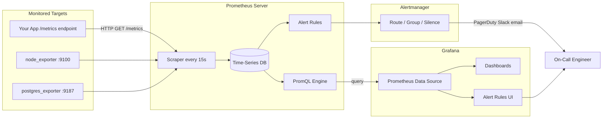
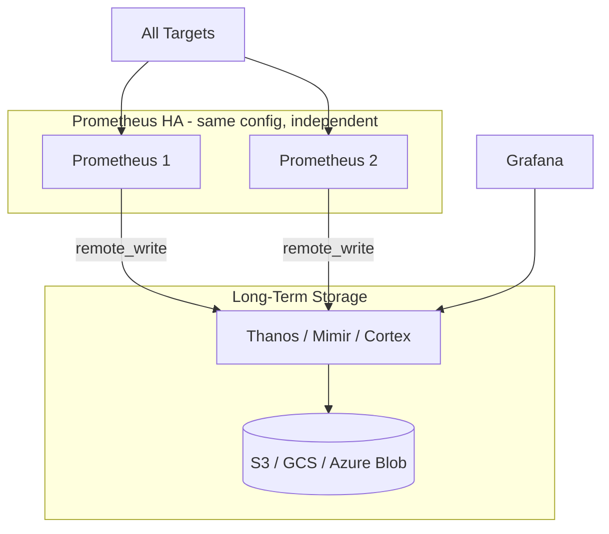

# Grafana & Prometheus — Learn, Remember, Master

> **Goal:** Go from zero to designing production-grade monitoring, dashboards, and alerts.  
> **How to use this guide:** Read one section, try every example in a lab (Docker or local install), then do the exercises.  
> **Stack:** Prometheus (metrics storage + query) + Grafana (visualization + alerting UI)

---

## Table of Contents

### Foundations
1. [What Is Observability?](#1-what-is-observability)
2. [Prometheus vs Grafana — Who Does What?](#2-prometheus-vs-grafana--who-does-what)
3. [Architecture Mental Model](#3-architecture-mental-model)
4. [Lab Setup (Quick Start)](#4-lab-setup-quick-start)

### Prometheus — Beginner to Intermediate
5. [Metrics and Time Series](#5-metrics-and-time-series)
6. [Metric Types (Memorize These)](#6-metric-types-memorize-these)
7. [Prometheus Configuration](#7-prometheus-configuration)
8. [Exporters — Getting Metrics In](#8-exporters--getting-metrics-in)
9. [PromQL Basics](#9-promql-basics)
10. [PromQL Intermediate — Rates, Aggregations, Joins](#10-promql-intermediate--rates-aggregations-joins)
11. [PromQL Advanced](#11-promql-advanced)

### Grafana — Beginner to Intermediate
12. [Grafana Basics](#12-grafana-basics)
13. [Building Your First Dashboard](#13-building-your-first-dashboard)
14. [Panel Types and When to Use Them](#14-panel-types-and-when-to-use-them)
15. [Variables and Templating](#15-variables-and-templating)
16. [Annotations and Dashboard Best Practices](#16-annotations-and-dashboard-best-practices)

### Alerting
17. [Alerting Mental Model](#17-alerting-mental-model)
18. [Prometheus Alertmanager](#18-prometheus-alertmanager)
19. [Grafana Alerting](#19-grafana-alerting)
20. [Alert Design — Avoiding Alert Fatigue](#20-alert-design--avoiding-alert-fatigue)

### Production & Expert Topics
21. [Instrumenting Your Own Applications](#21-instrumenting-your-own-applications)
22. [Recording Rules and Optimization](#22-recording-rules-and-optimization)
23. [Service Discovery](#23-service-discovery)
24. [High Availability and Scaling](#24-high-availability-and-scaling)
25. [Kubernetes Monitoring Pattern](#25-kubernetes-monitoring-pattern)
26. [Grafana Ecosystem — Loki, Tempo, Mimir](#26-grafana-ecosystem--loki-tempo-mimir)
27. [Security and Multi-Tenancy](#27-security-and-multi-tenancy)
28. [Production Best Practices](#28-production-best-practices)

### Reference
29. [Quick Reference Cheat Sheet](#29-quick-reference-cheat-sheet)
30. [Practice Exercises](#30-practice-exercises)
31. [Learning Path Summary](#31-learning-path-summary)

---

## 1. What Is Observability?

**Observability** means understanding the internal state of a system from the data it produces — without guessing.

### The Three Pillars

| Pillar | Question it answers | Tool in Grafana stack |
|--------|---------------------|------------------------|
| **Metrics** | *What is happening, and how much?* | **Prometheus** |
| **Logs** | *What exactly happened, line by line?* | **Loki** |
| **Traces** | *How did one request flow through services?* | **Tempo** |

This guide focuses on **metrics (Prometheus)** and **visualization/alerting (Grafana)** — the most common starting point.

### Metrics vs Logs vs Traces — Real Example

A web API returns errors:

| Signal | Example |
|--------|---------|
| **Metric** | `http_requests_total{status="500"} = 47` in the last 5 minutes |
| **Log** | `2026-07-30 14:22:01 ERROR NullPointerException at UserService.java:42` |
| **Trace** | Request `abc-123` → API Gateway (12ms) → Auth (45ms) → DB timeout (3000ms) |

**Remember:** Metrics tell you *something is wrong*. Logs and traces tell you *why*.

---

## 2. Prometheus vs Grafana — Who Does What?

| | Prometheus | Grafana |
|---|------------|---------|
| **Role** | Time-series database + query engine | Visualization + dashboard + alerting UI |
| **Stores data?** | Yes (on disk) | No (queries external sources) |
| **Query language** | PromQL | Uses PromQL for Prometheus data sources |
| **Collects metrics?** | Yes (pull model) | No |
| **Shows graphs?** | Basic (built-in UI) | Excellent (primary purpose) |
| **Sends alerts?** | Via Alertmanager | Built-in alerting (multi-source) |

**Analogy:**
- **Prometheus** = the warehouse that stores and counts inventory
- **Grafana** = the dashboard on the wall that draws charts from the warehouse

You almost always use **both together**.

---

## 3. Architecture Mental Model



### Key Concepts

| Concept | Meaning |
|---------|---------|
| **Target** | Anything Prometheus scrapes (app, exporter, itself) |
| **Scrape** | Prometheus pulls metrics over HTTP on an interval (default 15s) |
| **Time series** | A metric + label set + sequence of timestamp/value pairs |
| **Pull model** | Prometheus reaches out to targets (not targets pushing data) |
| **Retention** | How long Prometheus keeps data (default ~15 days; configurable) |

**Remember:** Prometheus **pulls** metrics. Exporters and apps **expose** an HTTP `/metrics` endpoint. Grafana **queries** Prometheus — it does not sit in the scrape path.

---

## 4. Lab Setup (Quick Start)

### Option A — Docker Compose (Recommended for Learning)

Create `docker-compose.yml`:

```yaml
services:
  prometheus:
    image: prom/prometheus:latest
    ports:
      - "9090:9090"
    volumes:
      - ./prometheus.yml:/etc/prometheus/prometheus.yml

  node-exporter:
    image: prom/node-exporter:latest
    ports:
      - "9100:9100"

  grafana:
    image: grafana/grafana:latest
    ports:
      - "3000:3000"
    environment:
      - GF_SECURITY_ADMIN_PASSWORD=admin
```

Create `prometheus.yml`:

```yaml
global:
  scrape_interval: 15s

scrape_configs:
  - job_name: prometheus
    static_configs:
      - targets: ["localhost:9090"]

  - job_name: node
    static_configs:
      - targets: ["node-exporter:9100"]
```

```bash
docker compose up -d

# Prometheus UI:  http://localhost:9090
# Grafana UI:     http://localhost:3000  (admin / admin)
# node_exporter:  http://localhost:9100/metrics
```

### Option B — Verify Without Docker

```bash
# After install, check Prometheus targets
curl http://localhost:9090/api/v1/targets

# Raw metrics from node_exporter
curl http://localhost:9100/metrics | head -20
```

### Add Prometheus as Grafana Data Source

1. Grafana → **Connections** → **Data sources** → **Add data source**
2. Select **Prometheus**
3. URL: `http://prometheus:9090` (Docker) or `http://localhost:9090`
4. **Save & test**

---

## 5. Metrics and Time Series

### Anatomy of a Metric

```
http_requests_total{method="GET", status="200", handler="/api/users"} 1042
│                   │                                              │    │
│                   └── labels (key=value pairs)                     │    └── value (float64)
└── metric name                                                      └── current count
```

### Labels

Labels create **dimensions** — they let you filter and group.

```
cpu_usage{host="web-01", region="us-east"} 72.5
cpu_usage{host="web-02", region="us-east"} 45.1
cpu_usage{host="db-01",  region="eu-west"} 91.3
```

**Golden rule:** Every unique combination of metric name + labels = one time series.

### Naming Conventions

```
<namespace>_<subsystem>_<name>_<unit>

Examples:
  http_requests_total          # counter, unit: total count
  process_cpu_seconds_total    # counter, unit: seconds
  node_memory_MemAvailable_bytes  # gauge, unit: bytes
  http_request_duration_seconds   # histogram/summary, unit: seconds
```

| Suffix | Meaning |
|--------|---------|
| `_total` | Counter (always increases) |
| `_seconds` | Duration in seconds |
| `_bytes` | Size in bytes |
| `_ratio` | Value between 0 and 1 |

---

## 6. Metric Types (Memorize These)

Prometheus has **4 metric types**. Choosing the right one matters.

### Counter — Only Goes Up (or Resets to 0)

**Use for:** things that accumulate — requests, errors, bytes sent.

```
http_requests_total 1024
http_requests_total 1025
http_requests_total 1027
```

**Never** use `rate()` on a gauge. **Always** use `rate()` or `increase()` on counters.

```promql
rate(http_requests_total[5m])   # requests per second over last 5 min
```

### Gauge — Goes Up and Down

**Use for:** current state — temperature, memory free, queue depth, active connections.

```
node_memory_MemAvailable_bytes 8.2e+09
node_memory_MemAvailable_bytes 7.9e+09
node_memory_MemAvailable_bytes 8.1e+09
```

```promql
node_memory_MemAvailable_bytes    # current value, no rate() needed
```

### Histogram — Distribution in Buckets

**Use for:** latency, request sizes — "how many requests finished under 100ms?"

Exposes multiple time series per histogram:

```
http_request_duration_seconds_bucket{le="0.1"}  800
http_request_duration_seconds_bucket{le="0.5"}  950
http_request_duration_seconds_bucket{le="1.0"}  990
http_request_duration_seconds_bucket{le="+Inf"} 1000
http_request_duration_seconds_sum    245.3
http_request_duration_seconds_count  1000
```

```promql
# 95th percentile latency
histogram_quantile(0.95, rate(http_request_duration_seconds_bucket[5m]))
```

### Summary — Pre-computed Quantiles

Similar to histogram but quantiles are calculated **at scrape time** (client-side). Less flexible for aggregation across instances. Histograms are preferred in modern setups.

### Quick Decision Guide

```
Does it only increase?           → Counter
Does it go up and down?          → Gauge
Do you need latency percentiles? → Histogram (preferred) or Summary
```

| Type | `rate()`? | Example |
|------|-----------|---------|
| Counter | Yes | `http_requests_total` |
| Gauge | No | `memory_used_bytes` |
| Histogram | On `_bucket`, `_sum`, `_count` | `request_duration_seconds` |
| Summary | On `_sum`, `_count` | legacy latency metrics |

---

## 7. Prometheus Configuration

### Main Config File: `prometheus.yml`

```yaml
global:
  scrape_interval: 15s       # how often to scrape targets
  evaluation_interval: 15s   # how often to evaluate alert rules

# Alertmanager connection
alerting:
  alertmanagers:
    - static_configs:
        - targets: ["alertmanager:9093"]

# Load alert rules
rule_files:
  - "alerts/*.yml"
  - "rules/*.yml"

scrape_configs:
  - job_name: prometheus
    static_configs:
      - targets: ["localhost:9090"]

  - job_name: node
    static_configs:
      - targets:
          - "10.0.0.1:9100"
          - "10.0.0.2:9100"
        labels:
          env: production
          region: us-east
```

### Important Config Sections

| Section | Purpose |
|---------|---------|
| `global` | Default scrape and evaluation intervals |
| `scrape_configs` | What to monitor and how |
| `rule_files` | Alerting and recording rules |
| `alerting` | Where to send fired alerts |
| `remote_write` | Send metrics to long-term storage (Cortex, Mimir, Thanos) |

### Reload Config Without Restart

```bash
# Send SIGHUP or use API
curl -X POST http://localhost:9090/-/reload
# Requires --web.enable-lifecycle flag on Prometheus
```

### Check Targets

Prometheus UI → **Status → Targets**, or:

```bash
curl -s http://localhost:9090/api/v1/targets | jq '.data.activeTargets[] | {job: .labels.job, health: .health}'
```

**Remember:** A target showing `DOWN` means Prometheus cannot reach `/metrics` — check firewall, port, and that the exporter is running.

---

## 8. Exporters — Getting Metrics In

Exporters are small programs that expose metrics Prometheus can scrape.

### Common Exporters

| Exporter | Port | What it monitors |
|----------|------|------------------|
| `node_exporter` | 9100 | Linux host (CPU, memory, disk, network) |
| `blackbox_exporter` | 9115 | HTTP/TCP/DNS probes (synthetic checks) |
| `postgres_exporter` | 9187 | PostgreSQL |
| `mysql_exporter` | 9104 | MySQL |
| `redis_exporter` | 9121 | Redis |
| `nginx-prometheus-exporter` | 9113 | Nginx |
| `cadvisor` | 8080 | Docker containers |
| `kube-state-metrics` | 8080 | Kubernetes object state |

### node_exporter — Essential Queries

```promql
# CPU usage %
100 - (avg by (instance) (rate(node_cpu_seconds_total{mode="idle"}[5m])) * 100)

# Memory usage %
(1 - node_memory_MemAvailable_bytes / node_memory_MemTotal_bytes) * 100

# Disk usage %
(1 - node_filesystem_avail_bytes{mountpoint="/"} / node_filesystem_size_bytes{mountpoint="/"}) * 100

# Network receive bytes/sec
rate(node_network_receive_bytes_total{device!="lo"}[5m])
```

### blackbox_exporter — Uptime Checks

Probes external URLs/endpoints:

```yaml
# blackbox.yml module
modules:
  http_2xx:
    prober: http
    timeout: 5s
    http:
      valid_status_codes: [200]
```

```yaml
# prometheus scrape config
- job_name: blackbox
  metrics_path: /probe
  params:
    module: [http_2xx]
  static_configs:
    - targets:
        - https://example.com
        - https://api.example.com/health
  relabel_configs:
    - source_labels: [__address__]
      target_label: __param_target
    - source_labels: [__param_target]
      target_label: instance
    - target_label: __address__
      replacement: blackbox-exporter:9115
```

---

## 9. PromQL Basics

**PromQL** (Prometheus Query Language) is how you read metrics.

### Instant Vector vs Range Vector

| Type | Syntax | Returns |
|------|--------|---------|
| **Instant vector** | `metric_name` | Latest value per series |
| **Range vector** | `metric_name[5m]` | All values in last 5 minutes per series |

### Selectors

```promql
# All series for a metric
http_requests_total

# Filter by label (exact match)
http_requests_total{status="500"}

# Regex match
http_requests_total{status=~"5.."}

# Negative match
http_requests_total{status!="200"}

# Multiple labels
http_requests_total{method="GET", status="200"}
```

### Label Matchers

| Matcher | Meaning | Example |
|---------|---------|---------|
| `=` | Equal | `{env="prod"}` |
| `!=` | Not equal | `{env!="dev"}` |
| `=~` | Regex match | `{status=~"5.."}` |
| `!~` | Regex not match | `{path!~"/health.*"}` |

### Basic Operators

```promql
# Arithmetic
node_memory_MemAvailable_bytes / node_memory_MemTotal_bytes * 100

# Comparison (returns 0 or 1 — used in alerts)
node_memory_MemAvailable_bytes / node_memory_MemTotal_bytes < 0.1

# Logical (for alerts)
rate(errors[5m]) > 0 and on(instance) up == 1
```

---

## 10. PromQL Intermediate — Rates, Aggregations, Joins

### `rate()` — Most Important Function

Converts a counter to **per-second average** over a time window.

```promql
rate(http_requests_total[5m])
```

**Why 5m?** Long enough to smooth spikes; short enough to react quickly. Use at least **4x scrape interval** (if scrape = 15s, minimum range = 1m; 5m is safe default).

```promql
# Requests per second by status code
sum by (status) (rate(http_requests_total[5m]))

# Error rate (5xx)
sum(rate(http_requests_total{status=~"5.."}[5m]))
  /
sum(rate(http_requests_total[5m]))
```

### `increase()` — Total Increase Over Window

```promql
# Total requests in last hour
increase(http_requests_total[1h])
```

### Aggregation Operators

```promql
sum(rate(http_requests_total[5m]))              # total across all instances
sum by (job) (rate(http_requests_total[5m]))     # grouped by job
avg(node_memory_MemAvailable_bytes)              # average memory
max(node_filesystem_avail_bytes)                 # worst disk
count(up == 0)                                   # number of down targets
topk(5, rate(http_requests_total[5m]))             # top 5 busiest
```

| Operator | Meaning |
|----------|---------|
| `sum` | Add values |
| `avg` | Average |
| `min` / `max` | Min / max |
| `count` | Count series |
| `topk(n, ...)` | Top N series |
| `bottomk(n, ...)` | Bottom N series |
| `count_values` | Count occurrences of each value |

### `by` vs `without`

```promql
# Group BY these labels (keep them)
sum by (method, status) (rate(http_requests_total[5m]))

# Group by ALL labels EXCEPT these (drop them)
sum without (instance) (rate(http_requests_total[5m]))
```

### Vector Matching — `on` and `ignoring`

Join two metrics that share labels:

```promql
# Error percentage per instance
sum by (instance) (rate(http_requests_total{status=~"5.."}[5m]))
/
sum by (instance) (rate(http_requests_total[5m]))
```

### Offset — Compare to Past

```promql
# Current vs 1 week ago
node_memory_MemAvailable_bytes
  -
node_memory_MemAvailable_bytes offset 1w
```

---

## 11. PromQL Advanced

### Subqueries

```promql
# Max of 5-min rates, evaluated every 30s over last hour
max_over_time(rate(http_requests_total[5m])[1h:30s])
```

### `histogram_quantile()` — Latency Percentiles

```promql
# p50, p95, p99 latency
histogram_quantile(0.50, sum by (le) (rate(http_request_duration_seconds_bucket[5m])))
histogram_quantile(0.95, sum by (le) (rate(http_request_duration_seconds_bucket[5m])))
histogram_quantile(0.99, sum by (le) (rate(http_request_duration_seconds_bucket[5m])))
```

**Remember:** Always `sum by (le)` before `histogram_quantile` when aggregating across instances.

### `predict_linear()` — Forecasting

```promql
# Disk will be full in how many seconds? (based on 1h trend)
predict_linear(node_filesystem_avail_bytes{mountpoint="/"}[1h], 3600 * 4)
```

Returns estimated value 4 hours from now. Alert if `< 0`.

### `absent()` — Detect Missing Metrics

```promql
# Alert if node_exporter stopped reporting
absent(up{job="node"} == 1)
```

### Useful Functions Reference

| Function | Purpose |
|----------|---------|
| `rate()` | Per-second rate for counters |
| `irate()` | Instant rate (last 2 points — spiky) |
| `increase()` | Total increase over range |
| `histogram_quantile()` | Percentile from histogram |
| `label_replace()` | Modify labels |
| `clamp_min()` / `clamp_max()` | Bound values |
| `time()` | Current Unix timestamp |
| `day_of_week()` | For business-hours alerts |

---

## 12. Grafana Basics

### Core Concepts

| Concept | Meaning |
|---------|---------|
| **Data source** | Where Grafana queries data (Prometheus, Loki, etc.) |
| **Dashboard** | Collection of panels |
| **Panel** | Single visualization (graph, stat, table, etc.) |
| **Query** | PromQL expression in a panel |
| **Variable** | Dynamic dropdown (e.g. pick instance) |
| **Folder** | Organizes dashboards |
| **Organization** | Top-level tenant in Grafana |

### Grafana UI Map

```
Home
├── Dashboards          ← your visualizations
├── Explore             ← ad-hoc query playground (great for learning PromQL)
├── Alerting            ← alert rules, contact points, silences
├── Connections         ← data sources
└── Administration    ← users, API keys, settings
```

### Explore — Best Tool for Learning

1. Open **Explore** (compass icon)
2. Select **Prometheus** data source
3. Type a PromQL query → **Run query**
4. Switch between **Builder** and **Code** mode

Use Explore before building dashboards — faster feedback loop.

---

## 13. Building Your First Dashboard

### Step-by-Step: Node Exporter Dashboard

**Panel 1 — CPU Usage (Stat)**

```promql
100 - (avg(rate(node_cpu_seconds_total{mode="idle"}[5m])) * 100)
```

- Visualization: **Stat**
- Unit: **Percent (0-100)**
- Thresholds: green < 70, yellow < 90, red >= 90

**Panel 2 — Memory Usage (Gauge)**

```promql
(1 - node_memory_MemAvailable_bytes / node_memory_MemTotal_bytes) * 100
```

- Visualization: **Gauge**

**Panel 3 — Network Traffic (Time series)**

```promql
# Receive
rate(node_network_receive_bytes_total{device!="lo"}[5m])

# Transmit
rate(node_network_transmit_bytes_total{device!="lo"}[5m])
```

- Visualization: **Time series**
- Unit: **bytes/sec**

**Panel 4 — Disk Usage (Bar chart)**

```promql
(1 - node_filesystem_avail_bytes / node_filesystem_size_bytes) * 100
```

- Legend: `{{mountpoint}}`

### Dashboard JSON

Dashboards are exportable JSON — store in Git for version control:

```
Dashboard → Settings (gear) → JSON Model → Copy
```

Or use **Provisioning** to load dashboards from files at startup.

---

## 14. Panel Types and When to Use Them

| Panel | Best for | Example |
|-------|----------|---------|
| **Time series** | Metrics over time | CPU, request rate, latency |
| **Stat** | Single current number | Current error rate, uptime % |
| **Gauge** | Value within a range | Memory %, disk % |
| **Bar chart** | Compare categories | Disk usage per mountpoint |
| **Table** | Multiple labeled values | Top 10 slow endpoints |
| **Heatmap** | Distribution over time | Request latency heatmap |
| **Logs** | Log lines | Loki log stream |
| **Pie chart** | Proportions (use sparingly) | Traffic by status code |

### Time Series Tips

- Use **Line interpolation**: linear for rates, step for counters
- Enable **Legend**: `{{instance}}`, `{{method}}`
- **Tooltip**: Shared crosshair for comparing series

### Stat Panel Tips

```promql
# Show "42.3 req/s" with sparkline
sum(rate(http_requests_total[5m]))
```

- **Value options** → **Calculation**: Last (not mean) for gauges
- Enable **Spark line** for context

---

## 15. Variables and Templating

Variables make one dashboard work across many servers, environments, or jobs.

### Create a Variable

Dashboard → **Settings** → **Variables** → **Add variable**

| Setting | Example |
|---------|---------|
| Name | `instance` |
| Type | Query |
| Data source | Prometheus |
| Query | `label_values(up{job="node"}, instance)` |
| Multi-select | true |
| Include All | true |

### Use Variable in Query

```promql
100 - (avg by (instance) (rate(node_cpu_seconds_total{mode="idle", instance=~"$instance"}[5m])) * 100)
```

### Variable Types

| Type | Use for |
|------|---------|
| **Query** | Dynamic list from Prometheus/Loki |
| **Custom** | Hardcoded list: `prod,staging,dev` |
| **Constant** | Hidden fixed value |
| **Interval** | `$__interval` — auto scrape step |
| **Datasource** | Switch between Prometheus instances |

### Chained Variables

```promql
# Variable: region
label_values(up, region)

# Variable: instance (filtered by region)
label_values(up{region="$region"}, instance)
```

---

## 16. Annotations and Dashboard Best Practices

### Annotations

Mark events on graphs (deployments, incidents):

- **Built-in:** Grafana shows alert state changes
- **Custom:** Query Prometheus or use API to add deployment markers

```promql
# Annotation query — show when deployments happened
changes(process_start_time_seconds[5m]) > 0
```

### Dashboard Design Rules

1. **One dashboard = one purpose** — "Node Overview", not "Everything"
2. **Top row = health summary** — red/green stats first
3. **Drill down** — overview → detail dashboard via links
4. **Use variables** — don't duplicate dashboards per environment
5. **Consistent time ranges** — default `now-1h` or `now-6h`
6. **Add descriptions** — panel subtitle explaining what "good" looks like
7. **Version control** — export JSON to Git

### RED Method (Services)

| Letter | Metric | PromQL example |
|--------|--------|----------------|
| **R**ate | Requests/sec | `sum(rate(http_requests_total[5m]))` |
| **E**rrors | Error rate | `sum(rate(http_requests_total{status=~"5.."}[5m])) / sum(rate(http_requests_total[5m]))` |
| **D**uration | Latency p95 | `histogram_quantile(0.95, sum by (le) (rate(http_request_duration_seconds_bucket[5m])))` |

### USE Method (Infrastructure)

| Letter | Metric | Example |
|--------|--------|---------|
| **U**tilization | % time busy | CPU %, disk I/O % |
| **S**aturation | Queue depth | `node_disk_io_time_weighted_seconds_total` |
| **E**rrors | Error count | `node_network_receive_errs_total` |

---

## 17. Alerting Mental Model

```
Metric collected
      ↓
Alert rule evaluated (every evaluation_interval)
      ↓
Condition true for `for` duration?  ← prevents flapping
      ↓
Alert FIRING
      ↓
Alertmanager routes → groups → silences → notifies
      ↓
PagerDuty / Slack / email / webhook
```

### Key Terms

| Term | Meaning |
|------|---------|
| **Alert rule** | PromQL condition + `for` duration |
| **Pending** | Condition true but `for` not yet satisfied |
| **Firing** | Condition true for full `for` duration |
| **Resolved** | Condition no longer true |
| **Silence** | Temporarily mute notifications |
| **Inhibition** | Suppress alerts when another is firing |

---

## 18. Prometheus Alertmanager

### Alert Rule Example (`alerts/node.yml`)

```yaml
groups:
  - name: node_alerts
    rules:
      - alert: HighCPUUsage
        expr: |
          100 - (avg by (instance) (rate(node_cpu_seconds_total{mode="idle"}[5m])) * 100) > 90
        for: 5m
        labels:
          severity: warning
        annotations:
          summary: "High CPU on {{ $labels.instance }}"
          description: "CPU usage is {{ $value | humanize }}% (threshold: 90%)"

      - alert: DiskSpaceLow
        expr: |
          (1 - node_filesystem_avail_bytes{mountpoint="/"} / node_filesystem_size_bytes{mountpoint="/"}) * 100 > 85
        for: 10m
        labels:
          severity: critical
        annotations:
          summary: "Disk space low on {{ $labels.instance }}"
          description: "Disk usage is {{ $value | humanize }}% on {{ $labels.mountpoint }}"

      - alert: InstanceDown
        expr: up == 0
        for: 2m
        labels:
          severity: critical
        annotations:
          summary: "Instance {{ $labels.instance }} is down"
```

### Alertmanager Config (`alertmanager.yml`)

```yaml
global:
  resolve_timeout: 5m

route:
  receiver: default
  group_by: [alertname, instance]
  group_wait: 30s       # wait before first notification
  group_interval: 5m    # wait before sending updated group
  repeat_interval: 4h   # re-notify if still firing
  routes:
    - match:
        severity: critical
      receiver: pagerduty
    - match:
        severity: warning
      receiver: slack

receivers:
  - name: default
    slack_configs:
      - api_url: "https://hooks.slack.com/services/XXX"
        channel: "#alerts"
        title: "{{ .GroupLabels.alertname }}"

  - name: pagerduty
    pagerduty_configs:
      - service_key: "your-key"

  - name: slack
    slack_configs:
      - api_url: "https://hooks.slack.com/services/XXX"
        channel: "#warnings"
```

### Template Variables in Annotations

```
{{ $labels.instance }}     — label value
{{ $value }}               — alert value
{{ $labels.job }}          — job name
{{ .StartsAt }}            — when alert fired
```

---

## 19. Grafana Alerting

Grafana has its own alerting engine (Grafana 8+) that works across data sources.

### Prometheus Alerting vs Grafana Alerting

| | Prometheus + Alertmanager | Grafana Alerting |
|---|---------------------------|------------------|
| **Data sources** | Prometheus only | Prometheus, Loki, SQL, etc. |
| **Where rules live** | Prometheus config files | Grafana UI or provisioning |
| **Routing** | Alertmanager | Grafana contact points + policies |
| **Best for** | Infra metrics, GitOps | Multi-source, unified UI |

### Grafana Alert Rule (UI)

1. **Alerting** → **Alert rules** → **New alert rule**
2. Set query: `avg(rate(http_requests_total{status=~"5.."}[5m])) / avg(rate(http_requests_total[5m])) > 0.05`
3. Set condition: IS ABOVE 0.05 for 5m
4. Add labels: `severity=critical`
5. Configure contact point: Slack, email, PagerDuty

### Contact Points

**Alerting** → **Contact points** → define Slack, email, webhook, PagerDuty, Teams.

### Notification Policies

Route alerts by label matching (similar to Alertmanager routes):

```
severity=critical  → PagerDuty
severity=warning   → Slack #warnings
team=backend       → Slack #backend-alerts
```

---

## 20. Alert Design — Avoiding Alert Fatigue

### Rules for Good Alerts

1. **Alert on symptoms, not causes** — "users getting 500 errors" not "pod restarted"
2. **Every alert must be actionable** — if no one acts, remove it
3. **Use `for` duration** — avoid flapping (minimum 2-5m for infra)
4. **Severity levels matter** — `critical` = wake someone up; `warning` = next business day
5. **Runbooks in annotations** — link to fix steps

```yaml
annotations:
  summary: "High error rate on {{ $labels.service }}"
  runbook_url: "https://wiki.example.com/runbooks/high-error-rate"
```

### Alert Quality Checklist

| Question | If No → fix |
|----------|-------------|
| Is someone on-call for this? | Assign owner |
| Is there a runbook? | Write one |
| Does it fire in tests? | Validate |
| Did it fire in last 30 days? | If never, maybe too strict |
| Did it fire > 10 times last week? | Too noisy — tune threshold |

### Symptom-Based Alert Examples

```promql
# BAD — alerts on pod restart (cause)
changes(kube_pod_container_status_restarts_total[5m]) > 0

# GOOD — alerts on error rate (symptom)
sum(rate(http_requests_total{status=~"5.."}[5m]))
/
sum(rate(http_requests_total[5m])) > 0.05
```

---

## 21. Instrumenting Your Own Applications

### Python (prometheus_client)

```bash
pip install prometheus-client
```

```python
from prometheus_client import Counter, Histogram, start_http_server
import time
import random

REQUEST_COUNT = Counter(
    "http_requests_total",
    "Total HTTP requests",
    ["method", "endpoint", "status"]
)

REQUEST_LATENCY = Histogram(
    "http_request_duration_seconds",
    "Request latency",
    ["method", "endpoint"],
    buckets=[0.01, 0.05, 0.1, 0.5, 1.0, 2.5]
)

def handle_request(method, endpoint):
    start = time.time()
    status = "200" if random.random() > 0.1 else "500"
    time.sleep(random.uniform(0.01, 0.5))
    REQUEST_LATENCY.labels(method=method, endpoint=endpoint).observe(time.time() - start)
    REQUEST_COUNT.labels(method=method, endpoint=endpoint, status=status).inc()

if __name__ == "__main__":
    start_http_server(8000)   # exposes /metrics on :8000
    while True:
        handle_request("GET", "/api/users")
        time.sleep(1)
```

Add to `prometheus.yml`:

```yaml
- job_name: myapp
  static_configs:
    - targets: ["localhost:8000"]
```

### Go (prometheus/client_golang)

```go
import (
    "github.com/prometheus/client_golang/prometheus"
    "github.com/prometheus/client_golang/prometheus/promhttp"
    "net/http"
)

var (
    requestsTotal = prometheus.NewCounterVec(
        prometheus.CounterOpts{
            Name: "http_requests_total",
            Help: "Total HTTP requests",
        },
        []string{"method", "status"},
    )
)

func init() {
    prometheus.MustRegister(requestsTotal)
}

func main() {
    http.Handle("/metrics", promhttp.Handler())
    http.ListenAndServe(":8080", nil)
}
```

### Instrumentation Checklist

- [ ] Expose `/metrics` endpoint
- [ ] Use Counter for requests/errors
- [ ] Use Histogram for latency (not Gauge)
- [ ] Add useful labels (not high cardinality — see below)
- [ ] Register default Go/Python runtime metrics
- [ ] Add `prometheus.yml` scrape config

### Cardinality Warning

**High cardinality** = too many unique label combinations = Prometheus explodes.

```
# BAD — user_id as label (millions of users = millions of series)
http_requests_total{user_id="12345"}

# GOOD — aggregate; log user_id in logs instead
http_requests_total{endpoint="/api/users"}
```

**Rule of thumb:** Keep total active series under **1 million** per Prometheus instance.

---

## 22. Recording Rules and Optimization

### Recording Rules — Pre-compute Expensive Queries

Store frequently-used query results as new metrics:

```yaml
# rules/recording.yml
groups:
  - name: aggregations
    interval: 30s
    rules:
      - record: job:http_requests:rate5m
        expr: sum by (job) (rate(http_requests_total[5m]))

      - record: job:http_errors:rate5m
        expr: sum by (job) (rate(http_requests_total{status=~"5.."}[5m]))

      - record: job:http_error_rate:ratio5m
        expr: job:http_errors:rate5m / job:http_requests:rate5m
```

Use in dashboards and alerts:

```promql
job:http_error_rate:ratio5m > 0.05
```

### When to Use Recording Rules

- Dashboard queries taking > 1s
- Same expensive query in many panels/alerts
- Aggregations across many instances

### Query Performance Tips

| Tip | Why |
|-----|-----|
| Use recording rules | Pre-aggregate |
| Shorter time ranges in dashboards | Less data scanned |
| Avoid `offset` in alerts | Use recording rules instead |
| Limit label cardinality | Fewer series to scan |
| Use `rate()` not `increase()` for alerts | Cleaner per-second values |

---

## 23. Service Discovery

Instead of hardcoding IPs, Prometheus auto-discovers targets.

### Supported Discovery Mechanisms

| Mechanism | Use case |
|-----------|----------|
| `static_configs` | Fixed targets, lab |
| `dns_sd_configs` | DNS-based discovery |
| `file_sd_configs` | JSON file updated by CM tool |
| `kubernetes_sd_configs` | Kubernetes pods/services |
| `ec2_sd_configs` | AWS EC2 instances |
| `azure_sd_configs` | Azure VMs |
| `consul_sd_configs` | Consul service catalog |

### Kubernetes Service Discovery Example

```yaml
scrape_configs:
  - job_name: kubernetes-pods
    kubernetes_sd_configs:
      - role: pod
    relabel_configs:
      # Only scrape pods with annotation prometheus.io/scrape=true
      - source_labels: [__meta_kubernetes_pod_annotation_prometheus_io_scrape]
        action: keep
        regex: true
      - source_labels: [__meta_kubernetes_pod_annotation_prometheus_io_port]
        action: replace
        target_label: __address__
        regex: (.+)
        replacement: ${1}
```

### Relabeling

Relabeling modifies targets **before** scraping:

| Action | Purpose |
|--------|---------|
| `keep` | Drop targets that don't match |
| `drop` | Remove matching targets |
| `replace` | Set/modify label values |
| `labelmap` | Copy meta labels |
| `hashmod` | Sharding across Prometheus instances |

---

## 24. High Availability and Scaling

### Single Prometheus Limits

- ~1 million active time series
- ~15 days retention (memory/disk dependent)
- Single point of failure

### HA Patterns



### Options for Scaling

| Solution | Type | Notes |
|----------|------|-------|
| **Thanos** | OSS | Sidecar + S3; global query view |
| **Grafana Mimir** | OSS/Enterprise | Horizontally scalable, multi-tenant |
| **Grafana Cloud** | Managed | Fully managed Prometheus + Grafana |
| **Cortex** | OSS | Multi-tenant, complex |
| **Federation** | Built-in | Hierarchical scrape (older pattern) |

### remote_write Config

```yaml
remote_write:
  - url: https://mimir.example.com/api/v1/push
    basic_auth:
      username: prometheus
      password: secret
```

### Prometheus HA Rule

Run **two identical Prometheus instances** scraping the same targets. Alertmanager deduplicates alerts from both. Grafana queries either (or Thanos/Mimir for unified view).

---

## 25. Kubernetes Monitoring Pattern

Standard K8s monitoring stack:

| Component | Purpose |
|-----------|---------|
| **node_exporter** (DaemonSet) | Per-node CPU/memory/disk |
| **kube-state-metrics** | Deployment/Pod/Node state |
| **cadvisor** (built into kubelet) | Container resource usage |
| **metrics-server** | `kubectl top` (not Prometheus) |
| **ServiceMonitor** (Prometheus Operator) | Declarative scrape config |

### Essential K8s Queries

```promql
# Pod CPU usage
sum by (namespace, pod) (rate(container_cpu_usage_seconds_total{container!=""}[5m]))

# Pod memory usage
sum by (namespace, pod) (container_memory_working_set_bytes{container!=""})

# Pods not ready
kube_pod_status_ready{condition="false"} == 1

# Deployment replicas mismatch
kube_deployment_spec_replicas != kube_deployment_status_replicas_available

# Container restarts in last hour
increase(kube_pod_container_status_restarts_total[1h]) > 0
```

### Prometheus Operator (Kubernetes-Native)

Uses CRDs instead of config files:

```yaml
apiVersion: monitoring.coreos.com/v1
kind: ServiceMonitor
metadata:
  name: myapp
spec:
  selector:
    matchLabels:
      app: myapp
  endpoints:
    - port: metrics
      interval: 30s
```

---

## 26. Grafana Ecosystem — Loki, Tempo, Mimir

### Loki — Log Aggregation

Like Prometheus, but for logs. Uses label-based indexing (not full-text on all content).

```logql
# LogQL — query language for Loki
{app="myapp"} |= "error"
{namespace="prod"} | json | status >= 500
rate({app="myapp"}[5m])
```

**Correlate logs + metrics in Grafana:** split view with Prometheus graph above Loki logs.

### Tempo — Distributed Tracing

Stores traces (OpenTelemetry, Jaeger format). Correlate trace ID with logs and metrics.

### Mimir — Scalable Prometheus

Long-term storage + global query view. Drop-in `remote_write` target.

### Unified Observability in Grafana

```
Metrics  → Prometheus / Mimir
Logs     → Loki
Traces   → Tempo
Dashboards → Grafana (all three in one UI)
```

**Exemplars** bridge metrics → traces: a histogram data point links to a trace ID.

---

## 27. Security and Multi-Tenancy

### Prometheus Security

| Concern | Mitigation |
|---------|------------|
| Unauthenticated `/metrics` | Network policy; don't expose publicly |
| Sensitive data in labels | Never put PII in labels |
| Prometheus UI | Put behind reverse proxy + auth |
| Alertmanager | Authenticate webhook endpoints |

### Grafana Security

- Enable **OAuth / SSO** (Azure AD, Google, GitHub)
- Use **RBAC** roles: Viewer, Editor, Admin
- **Service accounts** for automation (not personal API keys)
- **Datasource permissions** per team

### Multi-Tenancy Options

| Approach | How |
|----------|-----|
| Folder per team | Simple; one Grafana org |
| Grafana orgs | Separate namespaces per team |
| Mimir multi-tenancy | `X-Scope-OrgID` header per tenant |
| Separate Prometheus | Hard isolation; more ops overhead |

---

## 28. Production Best Practices

### Prometheus

- [ ] Run two Prometheus instances for HA
- [ ] Use Alertmanager for all alert routing
- [ ] Set retention based on disk: `storage.tsdb.retention.time=30d`
- [ ] Monitor Prometheus itself (`up`, `prometheus_tsdb_head_series`)
- [ ] Use recording rules for expensive queries
- [ ] Keep cardinality under control
- [ ] Store config in Git (GitOps)
- [ ] Use `remote_write` for long-term storage

### Grafana

- [ ] Store dashboards in Git (provisioning or Grafana API)
- [ ] Use folders per team/service
- [ ] Set up SSO
- [ ] Use variables — avoid dashboard sprawl
- [ ] Document panels (what does "good" look like?)
- [ ] Separate Grafana for prod vs dev (or use RBAC)

### Alerting

- [ ] Every alert has a runbook link
- [ ] Test alerts fire correctly (am I on-call for this?)
- [ ] Review alert noise monthly
- [ ] Use `for` duration on all alerts
- [ ] Critical = pages; Warning = ticket/Slack

### Monitoring Checklist for New Services

```
□ /metrics endpoint exposed
□ Added to prometheus.yml or ServiceMonitor
□ RED metrics: rate, errors, duration
□ Dashboard created
□ Alerts: high error rate, high latency, instance down
□ Runbook written
□ On-call rotation configured
```

---

## 29. Quick Reference Cheat Sheet

### PromQL Essentials

```promql
# Request rate
sum(rate(http_requests_total[5m]))

# Error rate
sum(rate(http_requests_total{status=~"5.."}[5m])) / sum(rate(http_requests_total[5m]))

# p95 latency
histogram_quantile(0.95, sum by (le) (rate(http_request_duration_seconds_bucket[5m])))

# CPU %
100 - (avg(rate(node_cpu_seconds_total{mode="idle"}[5m])) * 100)

# Memory %
(1 - node_memory_MemAvailable_bytes / node_memory_MemTotal_bytes) * 100

# Instance up?
up{job="myapp"}

# Predict disk full
predict_linear(node_filesystem_avail_bytes[1h], 4*3600) < 0
```

### Metric Types

```
Counter  → rate() / increase()
Gauge    → direct value
Histogram → histogram_quantile() on _bucket
```

### Alert Rule Template

```yaml
- alert: AlertName
  expr: promql_expression > threshold
  for: 5m
  labels:
    severity: warning
  annotations:
    summary: "Short description {{ $labels.instance }}"
    description: "Value: {{ $value }}"
    runbook_url: "https://wiki/runbook"
```

### Key Ports

| Service | Port |
|---------|------|
| Prometheus | 9090 |
| Alertmanager | 9093 |
| Grafana | 3000 |
| node_exporter | 9100 |

### Useful URLs

| URL | Purpose |
|-----|---------|
| `http://prometheus:9090/targets` | Scrape target health |
| `http://prometheus:9090/graph` | PromQL UI |
| `http://prometheus:9090/alerts` | Active alerts |
| `http://grafana:3000/explore` | Ad-hoc queries |

---

## 30. Practice Exercises

### Level 1 — Beginner

1. Set up Prometheus + node_exporter + Grafana with Docker Compose.
2. Add Prometheus as a Grafana data source.
3. Run query: `up` — what does it return?
4. Build a dashboard with CPU, memory, and disk panels.
5. Find `node_memory_MemAvailable_bytes` in Explore and convert it to a percentage.

### Level 2 — Intermediate

6. Write an alert rule: CPU > 80% for 5 minutes.
7. Configure Alertmanager to send to Slack (or a webhook tester).
8. Create a dashboard variable for `instance` and filter all panels by it.
9. Write PromQL for request error rate given `http_requests_total{status}`.
10. Add a recording rule for `job:http_requests:rate5m`.

### Level 3 — Advanced

11. Instrument a Python or Go app with Counter and Histogram; scrape it.
12. Set up `blackbox_exporter` to probe 3 URLs; alert if any are down.
13. Write a `histogram_quantile` query for p99 latency.
14. Configure Kubernetes ServiceMonitor for a pod (if you have K8s access).
15. Design a RED dashboard for a microservice with rate, error rate, and p95 latency.

### Level 4 — Expert

16. Set up Prometheus `remote_write` to Grafana Cloud or Mimir.
17. Implement Prometheus HA with two instances and one Alertmanager.
18. Create a unified dashboard with Prometheus metrics + Loki logs (split view).
19. Write relabeling rules to drop high-cardinality labels.
20. Conduct an "alert audit" — review all firing alerts, remove noise, add runbooks.

### Sample Solution (Exercise 9 — Error Rate)

```promql
sum(rate(http_requests_total{status=~"5.."}[5m]))
/
sum(rate(http_requests_total[5m]))
* 100
```

---

## 31. Learning Path Summary

```
Week 1: Sections 1-8   → Concepts, lab setup, metric types, exporters
Week 2: Sections 9-11  → PromQL beginner to advanced
Week 3: Sections 12-16 → Grafana dashboards, variables, best practices
Week 4: Sections 17-20 → Alerting (Prometheus + Grafana)
Week 5: Sections 21-25 → Instrumentation, K8s, scaling
Week 6: Sections 26-28 → Loki/Tempo/Mimir, security, production
Ongoing: Section 30    → Practice exercises until fluent
```

### Mental Model to Remember

```
Apps/Exporters  →  expose /metrics
Prometheus      →  scrapes & stores  →  PromQL
Alertmanager    →  routes alerts
Grafana         →  queries & visualizes  →  you
```

### Recommended Resources

| Resource | URL |
|----------|-----|
| Prometheus docs | https://prometheus.io/docs/ |
| PromQL basics | https://prometheus.io/docs/prometheus/latest/querying/basics/ |
| Grafana docs | https://grafana.com/docs/ |
| PromQL cheat sheet | https://promlabs.com/promql-cheat-sheet/ |
| Awesome Prometheus | https://github.com/rodrikish/prometheus-alerting-guide |
| Node exporter full metrics | https://github.com/prometheus/node_exporter |

**Final tip:** The fastest way to learn is to **monitor something real** — your laptop with node_exporter, a side project API, or a homelab K8s cluster. Reading PromQL without a live Prometheus to query against does not stick.
